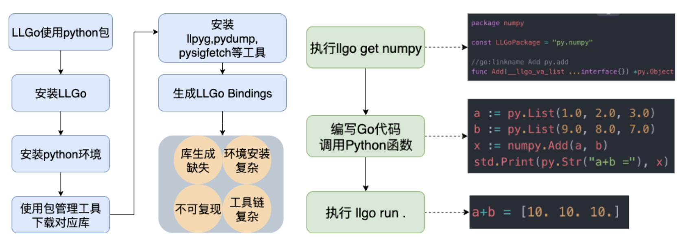
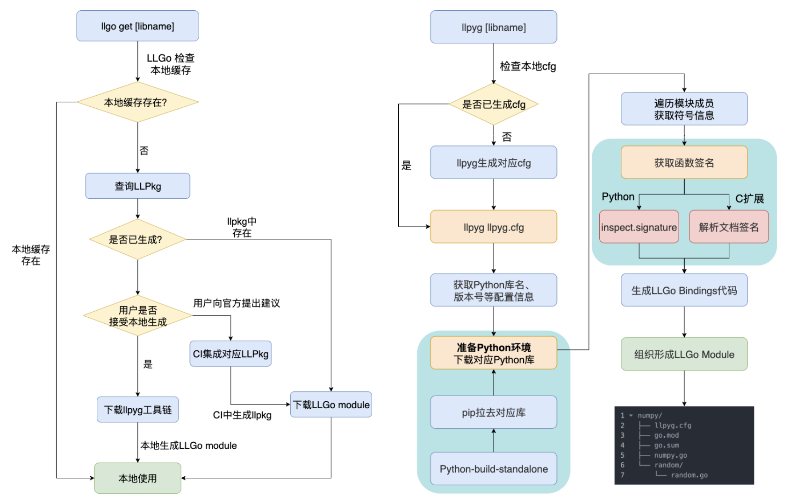
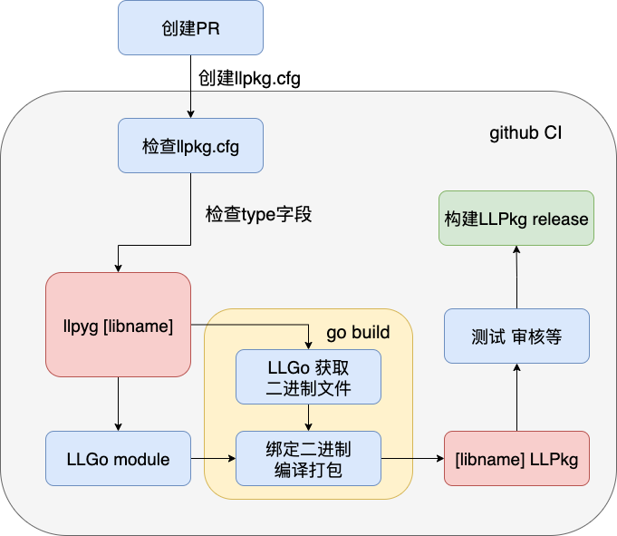

# 项目概述

**项目主题**：推动 LLGo 对 Python 库开箱即用能力的建设

**项目目标**：让 LLGo 用户能够通过简单命令（如 `llgo get numpy`）自动安装和使用 Python 库，无需手动配置环境，实现跨平台一致的依赖管理体验。

## 项目目标

LLGo 使用 Python 的用户体验：



**最终目标**：

- 无需配置 Python 环境
- 无需手动下载和管理第三方库
- **像调用 Go 函数一样调用 Python 函数**

## **产品设计**


- **llpyg**：Python 库转换工具，用于将 Python 库转换为 LLGo 能够调用的 LLGo Bindings。
- **LLPkg**：LLGo包管理仓库，里面存放的有 LLGo Bindings（以 Go module 的形式组织，存放在 Github 仓库中）、LLGo 运行 LLGo Bindings 所需要的二进制文件（存放在 release 中）。

## 交互流程草图



# 重要概念

## LLGo Bindings

LLGo Bindings 是为指定 Python 库生成的 Go 代码，LLGo 借助 LLGo Bindings 实现与 Python 库的交互。

以 NumPy 库为例，对应的 LLGo Bindings 示例：

```go
package numpy

import (
    "github.com/goplus/lib/py"
    _ "unsafe"
)

const LLGoPackage = "py.numpy"
// ...
//
//go:linkname ShowConfig py.show_config
func ShowConfig(mode *py.Object) *py.Object
```

- LLGoPackage 字段：定义包的类型和名称
- go:linkname 指令：帮助 LLGo 识别函数对应的名称

## llpyg

llpyg 用于为指定的 Python 库生成对应的 LLGo Bindings，命令示例：`llpyg numpy`

目前 llpyg 中包含两个重要命令：

1. pydump：从 Python 模块中提取符号信息
2. pysigfetch：从第三方库的官网文档中爬取数据，用于补充函数签名

**llpyg 生成 LLGo bindings 流程：**

1. pydump：利用反射获取 Python 模块下的所有符号信息，包括名称、类型、文档和函数签名
2. 使用 gogen 初始化 go 代码，导入必要模块，设置 LLGoPackage
3. 遍历符号成员，添加 LLGo Bindings 函数声明
4. 对于签名缺失的函数，尝试使用 pysigfetch 从官网文档获取
5. 生成 LLGo Bindings 代码

**目前 llpyg 存在的一些问题：**

- C 实现的函数签名缺失
- 暂不支持类符号信息的处理
- 暂不支持子模块符号信息提取
- 支持处理的函数类型有限
- pysigfetch 工具并不通用

## LLPKg与LLPkgStore

### LLPkg

**LLPkg** 是 LLGo 包管理仓库，里面存放的有 LLGo Bindings 和 LLGo 运行 LLGo Bindings 所需要的二进制文件。

LLGo Bindings 以 Go module 的形式组织，存放在 Github 仓库中：

```Go
pylib/numpy/
├── go.mod
├── go.sum
├── llpyg.cfg            // llpyg 配置文件
├── numpy.go            // numpy 模块的 go binding
└── random/
    └── ranom.go        // numpy.random 模块的 go binding
```

Github release 页面存放的二进制文件的作用是实现 LLGo 对 Python 库的开箱即用。

当用户执行 `llgo build` 时，会尝试从 Github release 中拉取运行所需要的二进制文件，使得无需额外的环境配置与包管理。

### LLPkgStore

LLPkgStore 是一个为 LLGo 设计的包分发服务。自动生成 LLPkg，并将其上传到 LLPkg 仓库中。

**包生成流程：**

1. 配置解析：读取 llpkg.cfg 配置文件
2. 上游安装：通过 pip 工具安装 Python 库二进制文件
3. 代码生成：使用 llpyg 生成 Go 绑定代码
4. 测试验证：运行 _demo 目录中的测试
5. 发布：通过 GitHub Actions 自动发布

**提供版本映射功能**，将 Python 库版本映射到 Go 模块版本：

- 主版本：上游 Python 库的重大变更
- 次版本：上游 Python 库的非破坏性更新
- 补丁版本：llpkg 内部修复或上游补丁

## Go Module 与 Python Package

### Go Module

从 1.13 版本开始 Go 语言默认使用 Go Module 作为依赖管理工具，核心概念：

1. go.mod：定义模块名称、Go 版本和依赖项
2. go.sum：记录依赖项的校验和，确保一致性
3. 语义化版本 (SemVer)：支持 v1.2.3 格式的版本号

`go.mod` 中声明了项目的依赖：

```Go
// 定义了项目的依赖包及其版本
require (
        github.com/goplus/cobra v1.9.12 //gop:class
        github.com/goplus/gogen v1.19.0
)

// indirect：表示这些依赖是间接依赖，不是项目直接引用的，而是由其他依赖传递引入的
require (
        golang.org/x/mod v0.26.0 // indirect
)

// 替换模块依赖路径
replace github.com/goplus/llgo/runtime => ./runtime
```

**语义化版本控制 (SemVer) 格式**：`vX.Y.Z`

- `X`：主版本号，当你做了不兼容的 API 修改
- `Y`：次版本号，当你做了向下兼容的功能性新增
- `Z`：修订号，当你做了向下兼容的问题修正

### Python Package

Python Package（Python 包） 是一种用于分发和复用 Python 代码的标准格式。它通常包含一个或多个模块（.py 文件），以及元数据（如包名、版本、依赖等），可以通过 pip 等工具进行安装和管理。

**常见的 Python 包类型**：

1. 纯源码包：以 .tar.gz 或 .zip 结尾，包含源码、setup.py 等文件，安装时需要本地编译（如果有 C 扩展）
2. 二进制包：以 .whl 结尾，已经编译好（如果有 C 扩展），安装速度快

从 PyPI 下载对应的分发文件，安装后，包内容会被解压到 Python 的 site-packages 目录下，结构如下：

```Go
site-packages/
  ├── 包目录/
  │     ├── __init__.py
  │     ├── 其他模块.py
  │     └── ...
  ├── 包名-version.dist-info/
  │     ├── METADATA
  │     ├── RECORD
  │     └── ...
```

PEP 440 是 Python 官方定义的版本标识和依赖规范，版本号基本结构：

```Plain
主版本号.次版本号.修订号[.可选发布号][可选开发或预发布标识]
```

- 主版本号：重大更新（不兼容的 API 变更）
- 次版本号：新增功能（向下兼容）
- 修订号：Bug 修复（向下兼容）
- 发布号：可选，用于小幅更新（如 1.0.0.1）

**版本号命名规则对比**：
| 版本部分 | PEP 440 | SemVer |
| --- | --- | --- |
| 主版本号 | 重大变更，可能不兼容 | 重大变更，不兼容旧版本 (MAJOR) |
| 次版本号 | 新功能，向后兼容 | 新增功能，向后兼容 (MINOR) |
| 修订号 | 错误修复，向后兼容 | 错误修复，向后兼容 (PATCH) |
| 预发布 | 严格定义的 a/b/rc | 自由格式的预发布标签 |

# 关键决策

## llpyg.cfg 设计

### 设计决策

```JSON
{
  "name": "numpy",
  "pythonLib": "numpy",
  "pythonLibVersion": "2.3.0",
  "deps": ["github.com/goplus/llpkg/numpy"]
}
```

### 选项说明

- **name**：生成的 Go 包名和输出目录名。Go 语言的包名具有一定的要求，不允许有连字符或者大写字母的，为了符合 Go 的命名规则，需要对一些Python 库的名称进行修改。
- **pythonLib**：要转换的 Python 库名。llpyg 根据该字段导入指定 Python 模块进行分析。
- **pythonLibVersion**：明确版本，不同版本的 Python 库有不同的 API，根据版本选择正确的 API 调用，避免生成不兼容的代码。
- **deps**：标明当前包所依赖的其他包。

## Python 环境构建

为保证对用户环境的最小改变，我们期望可以构建**与原生系统隔离的 Python 环境**。

为将庞大而复杂的 CPython 库完整地转换 LLGo 可使用的 Go 语言包，我们探索了两种主要途径：

1. 使用 llcppg 构建 CPython
2. 利用预编译的独立 Python 发行版

### 路线一：使用 llcppg构建 CPython

通过 [Conan Center](https://conan.io/center) 提供的 CPython 包结构，我们可以系统地构建 CPython 及其所有依赖。

**优点：**

- **标准化**：作为 llpkg 中的一个包，依赖关系清晰；利用 llpkgstore 版本管理，省去包管理的工作量。
- **可复现**：构建过程可控，可复现。

**挑战：**

1. **庞大的依赖树**： 一个功能完备的 CPython 依赖数个底层 C 库，手动为每一个库生成 `llcppg` 绑定配置的工作量巨大。

```mermaid
graph TD
    subgraph CPython 3.12.7
        cpython[cpython]
    end

    subgraph Core Dependencies
        bzip2[bzip2 1.0.8]
        libffi[libffi 3.4.4]
        libgettext[libgettext 0.22.5]
        lzma[lzma 5.6.2]
        mpdecimal[mpdecimal 2.5.1]
        openssl[openssl 3.3.1]
        sqlite3[sqlite3 3.45.3]
        zlib[zlib 1.3.1]
    end

    subgraph Transitive Dependencies
        libiconv[libiconv 1.17]
        zlib_trans[Zlib 1.3.1]
    end

    cpython --> bzip2
    cpython --> libffi
    cpython --> libgettext
    cpython --> lzma
    cpython --> mpdecimal
    cpython --> openssl
    cpython --> sqlite3
    cpython --> zlib

    libgettext --> libiconv
    openssl --> zlib_trans

```

2. **`llcppg`** **工具的局限性**：在实践中，我们发现 `llcppg` 面对 CPython 这种规模的库时，存在一些待完善之处，如缺失某些系统库中的符号映射、需要手动处理底层类型依赖等。
3. **跨平台打包的巨大工作量**：为 Windows, macOS (x86/arm64), Linux (glibc/musl) 等不同平台分别构建和验证这套庞大的依赖树，将是一项耗时耗力的工程。

**结论：**虽然技术上可行，但使用 Conan 和 `llcppg` 从头构建完整的 CPython 绑定，**当前阶段成本过高，投入产出比较低**。

### 路线二：`python-build-standalone`  (推荐)

这是一个由 `uv` 和 `Ruff` 的开发者 [Astral](https://github.com/astral-sh) 维护的项目，旨在提供**预编译、自包含、可重分发**的 Python 发行版。

**优点：**

- **开箱即用**：无需手动编译 CPython 和处理复杂的依赖关系。
- **轻量级**：仅包含运行 Python 所必需的核心依赖，体积小，易于集成。
- **跨平台**：官方已为所有主流平台和架构提供了预编译好的包。

### **方案决策**

采用 `python-build-standalone` 是一个**更高效**的方案。它极大地简化了环境配置，使我们能够专注于核心的 LLGo-Python 交互逻辑，而非陷入底层库的编译和打包泥潭。

## Python 函数签名获取

### 问题描述

Python函数签名的获取是 llpyg 生成 LLGo Bindings 的重要一步，只有获取到函数签名，才能生成对应函数的LLGo Binding。

**目前存在问题**：llpyg 目前通过 `inspect.signature` 获取签名信息，但该方法只对 Python 编写的函数起作用，**无法处理 C 实现的 Python 函数**。

### 可行性探讨

**方案1: 从doc中提取**

调研发现第三方库的作者通常会为这些函数添加 doc 注释，以便使用 pydoc 命令快速生成库文档。在文档的第一行通常会声明函数签名。以 NumPy 库为例，官网文档信息和通过 `inspect.getdoc()` 获得的文档信息一致。


可靠性讨论：在不改变第三方库源码的情况下，从文档中获取函数签名是可靠的。

- 优点：方法简单，签名与函数的注释保持一致
- 缺点：可能仍然会存在某些函数的 doc 中不包含签名

**方案2: 从 C 源码中获取**

以 NumPy 包为例，C 编写的函数具体实现在扩展模块 `.so` 文件，要想获取源码，需要解析二进制文件，难度较大。


查找源码 `numpy/_core/src/multiarray/multiarraymodule.c` 也发现，C 的函数签名和 Python 的函数签名也有一定出入，因此，从 C 源码中获取函数签名虽然具有一定的可行性，但难度较大，产出较低

### 方案决策

使用**方案1**解决 C 编写的函数签名问题，原因：

1. 实现简单
2. 文档信息由第三方库的作者编写，在不改变库源码的情况下，签名是可信的

**最终函数签名提取策略**：

1. 对于 Python 编写的函数，使用 `inspect.signature` 获取签名信息
2. 对于 C 编写的函数，首先通过 `inspect.getdoc` 获取文档信息，然后从文档中获取签名
3. 如果确认该符号为函数或方法，但无法获取签名，可以选择跳过或将签名设置为 `(*args, **kwargs)`

## LLPkg 集成发布

### 集成发布流程图

llcppg 有一套相对成熟的转换和发布机制，采用 LLPkgStore 能成功地将 C/C++ 的对应库进行绑定并上传到仓库。因此决定在 LLPkgStore 的基础上实现 llpyg 流程的转换与发布，确保系统一致性。



### 包管理工具选择

LLPkgStore 采用 Conan 作为 C/C++ 语言的包管理解决方案，主要用于处理编译时依赖关系。对于 Python，我们调研了 pip 和 uv ：

| 工具         | pip                                                        | uv                                                          |
| ------------ | ---------------------------------------------------------- | ----------------------------------------------------------- |
| 获取的包来源 | 默认从 PyPI 获取 Python 包                                 | 默认从 PyPI 获取 Python 包                                  |
| 官方推荐     | Python 官方推荐的包管理工具                                | 由 Astral 开发，非官方                                      |
| 功能覆盖     | 功能更全面，生态成熟，多年发展积累，成熟稳定，用户基础广泛 | 支持 pip 的部分核心功能，但缺少部分插件支持（如 pip-tools） |
| 兼容性       | 与 PyPI 完全兼容，稳定性高                                 | 可能对某些特殊包或私有源的支持不如 pip 稳定                 |
| 安装方式     | 默认集成，开箱即用                                         | 需单独安装（`pip install uv`），不随 Python 默认提供        |

综合考虑工具成熟度、功能完整性、生态兼容性以及跨平台稳定性等因素，`pip` 仍然是目前 Python 包管理领域更全面、更可靠的选择，特别是在生产环境和复杂项目开发中。

### **llpkg.cfg 设计决策**

llpkg.cfg 目前通过 `installer.name` 字段获取包生成器类型，但这种将语言环境与包管理器强绑定的做法存在明显缺陷：

- 若未来更换包管理工具（如 Python 环境不再使用 pip/uv 或 C++ 环境弃用 conan），就需要新增标识字段，导致维护成本增加。
- 由于该配置文件还需服务于 `llgo get` 等其他命令，仅通过包管理器来区分语言类型会严重制约系统的扩展性。

因此，在 llpkg.cfg 中增加 "type" 字段，用以区分用户需要生成的包的语言类型（C/C++ 还是 Python），而不采用原先的通过包管理器进行区分。以 llpkg.cfg 进行举例：

```JSON
{
  "type":"python",
  "upstream": {
    "installer": {
      "name": "pip",
      "config": {
        "python_version": "3.12",
        "index_url": "https://pypi.org/simple/",
        "extra_index_url": "https://pypi.org/simple/",
        "trusted_host": "pypi.org"
      }
    },
    "package": {
      "name": "numpy",
      "version": "1.26.4"
    }
  }
} 
```

